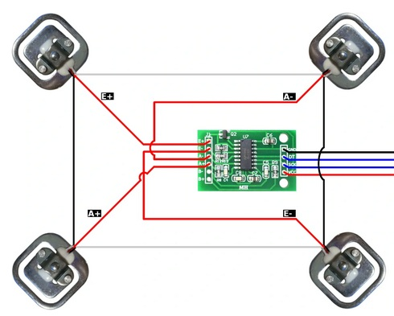

# WaterSoftenerMonitor
This ESPHome Code shows how to implement an Aqmos R2D2 Water Softener into Home Assistant or any Smart Home solution. 

An ESPHome based monitoring system for water softener. This project tracks salt levels using a load cell, measures water consumption via a flow meter, and provides early warning for leaks using a capacitive sensing wire.


## ✨ Features
- Salt Level Monitoring: Uses an HX711 load cell amplifier to weigh the remaining salt in the brine tank.
- Water Consumption: Tracks real-time flow rate (l/h) and total water consumption (liters) using a pulse-based flow meter.
- Capacitive Leak Detection: Utilizes the ESP32-S3's native touch sensors and a simple wire on the floor to detect water leakages.
- Home Assistant Integration: Fully compatible with Home Assistant via the Native API.
- Local Web Server: Live dashboard accessible directly via the device's IP address.

## 🛠 Hardware Requirements
- Component	Description	Pin (Configurable)<br/>
- ESP32-S3	DevKitC-1 or similar <br/>
- HX711	Load Cell Amplifier (for salt weight)	GPIO2 (DT), GPIO3 (SCK)<br/>
- Flow Meter	Hall-effect pulse sensor	GPIO1<br/>
- Leak Sensor	Simple insulated wire (Capacitive)	GPIO9<br/>

## 🔌 Wiring Diagram (Logical)
### HX711

Connect VCC to 3.3V, GND to GND, DT to GPIO2, and SCK to GPIO3. Weight cell interconnection for 4 cells is depicted as in the picture shown. <br/>

- Data accuracy: 24 bit (A/D converter)
- Max Refresh Rate: 80 Hz
- Operating Voltage: 5V (DC)
- Operating current: <5 mA
- Size: 38mm * 21mm * 10mm

An excellent tutorial of using 4 load cells with an HX711 with code and video tutorial can be found on [ELECTRONOOBS](https://electronoobs.com/eng_arduino_tut115_2.php). 

## 

### Flow Meter


The flow meter of the BNT-1650 provides a high 3.3V on the data line, which is pulled to GND every time a certain amount of water is measured. (See Sensors Provided)
- The red wire is VCC and will not be connected to our ESP32. Instead it will be reconnected and provide power for the flow meter.
- Blue is wire-tapped by the green cable and forwarded to any available GPIO (we use GPIO1 in our code).
- Black provides a common ground and will be connected to GND of the ESP32.

### Water Leakage Wire
Connect a single wire to GPIO9. Lay the stripped end or a conductive tape flat on the floor/bottom of the tray where water would collect. The capacitive sensor of the ESP32 will change its measured value drastically every time it touches water. This is the reason we use an ESP32 S3. In case you are using an ESP8266, ESP32-C3 or any other micro controller with no capacitive sensor, consider using an irrigation sensor or soil moisture sensor. 
[RandomNerdTutorials](https://randomnerdtutorials.com/esp32-touch-pins-arduino-ide/) has an excellent tutorial of how to use capacitive sensor pins of an ESP32. However, it is basically connecting an stripped wire to a capacitive pin of your ESP32 (really mothing fancy at all...).

## 🚀 Installation
As of now, this solution is only provided as a yaml in ESPHome. More implementations might be added.
### ESPHome
Ensure you have ESPHome installed (Dashboard or CLI).
Secrets: Create a secrets.yaml file in your ESPHome directory with the following keys:
```
wifi_ssid: "Your_SSID"
wifi_password: "Your_Password"
api_key: "Generated_API_Key"
ota_password: "Your_OTA_Password"
fallback_password: "AP_Fallback_Password"
```
Flash: Connect your ESP32-S3 via USB and run:
bash
esphome run watersoftener.yaml

## ⚖️ Calibration
### Salt Weight (HX711)
The current configuration uses calibrate_linear. To calibrate your specific load cell:
Read the raw value when the tank is empty.
Place a known weight (e.g., 10kg of salt) in the tank and read the value again.
Update the filters section under the hx711 platform in the YAML.
### Leak Sensor
The project includes a Raw Leakage Value sensor.
Check the raw value in the logs while the wire is dry.
Touch the wire with a damp cloth and check the value again.
Adjust the threshold: 50000 in the binary_sensor section to a value slightly above the "wet" reading.
### Water Flow
Adjust pulse_factor_total and pulse_factor_current based on your flow meter's datasheet (usually expressed as pulses per liter).

## 📊 Sensors Provided
| Sensor Name           | Unit   | Description                                                                                                                |
|-----------------------|--------|----------------------------------------------------------------------------------------------------------------------------|
| Water Softener Weight | kg     | The complete weight of the softener. Based on the amount of salt added, it can be derived whenever the salt tank is empty. |
| Hot Water Flow Rate   | l/h    | Current water flow speed measured by the pulse meter.                                                                      |
| How Water Consumption | l      | Total amount of water used since last reset. Can be aggregated with an Utility Meter in Home Assistant.                    |
| Water Leakage         | binary | ON if water leak is detected, OFF in normal state.                                                                         |
| Wifi Signal           | dBm    | Signal strength of the Wifi connection for troubleshooting.                                                                |

## 📝 License
This project is open-source and available under the MIT License.

## 🛠 Tech Stack
Framework: ESPHome (ESP-IDF)
Microcontroller: ESP32-S3
Integration: Home Assistant
